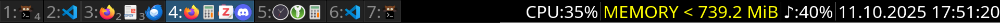

# i3 Workspace Icons


*Example: i3bar showing workspaces with icons for currently running programs*

Dynamically update i3wm workspace names with program icons of currently running programs. Since i3bar cannot display images directly, this daemon creates a custom font on-the-fly from system icon files that i3bar can render. 

## Features
- **Original color icons**: Displays the correct icons for any program (as they appear in desktop environments like GNOME)
- **Fast updates**: Icons in workspace names update automatically when programs change or move between workspaces
- **SVG and PNG support**: Handles both SVG (preferred) and PNG icon formats
- **Program count indicators**: When multiple instances of the same program are running, their count can be shown with subscripts or superscripts

## How It Works

Since i3bar cannot display images directly, this daemon creates a custom font from program icons on-the-fly:

1. The daemon monitors i3 window events (new, close, move)
2. When a new program is detected:
   - Finds the program's `.desktop` file
   - Extracts the `Icon=` entry to locate the icon file in standard system directories
   - Assigns the program a Unicode codepoint in the Private Use Area (PUA)
   - Rebuilds the custom font with all known icons
   - Stops i3bar (to prevent crashes when modifying the active font)
   - Installs the font to `~/.local/share/fonts/`
   - Restarts i3bar
   - Reloads the font cache with `fc-cache`
   - Restarts i3bar again to load the updated cache
3. Workspace names are updated with icon characters from the custom font whenever window events occur
4. A program-to-icon map is persisted for consistency and fast restarts. The font is only rebuilt when a new program is encountered

# Installation

## Prerequisites

Most systems already have these installed:
- `fontconfig`
- `libcairo2`

On Debian/Ubuntu:
```bash
sudo apt install fontconfig libcairo2
```

## Quick Install

### Install Python Package

```bash
git clone https://github.com/David0tt/i3bar_workspace_icons
pip install i3bar_workspace_icons/
```

### i3 Configuration

Add to your `~/.config/i3/config`:

```
# Change the i3bar font
bar {
    font i3WorkspaceDaemonIconFont 20
    height 30  # Required to prevent incorrect bar height
}

# Auto-start the daemon
exec_always --no-startup-id i3-workspace-icon-daemon

# Use workspace numbers in keybindings
# (Standard config uses workspace names, which won't work since names change dynamically)
bindsym $mod+1 workspace number 1
bindsym $mod+2 workspace number 2
# ... continue for other workspaces
```

## Using Conda for Environment Management (Recommended)

We create an isolated Python environment:

```bash
conda create -n i3WorkspaceIcons python==3.12 -y
conda activate i3WorkspaceIcons
git clone https://github.com/David0tt/i3bar_workspace_icons
pip install i3bar_workspace_icons/
```

Then add to your `~/.config/i3/config`:

```
# Change the i3bar font
bar {
    font i3WorkspaceDaemonIconFont 20
    height 30
}

# Auto-start the daemon with conda environment
exec_always --no-startup-id bash -c "source ~/miniconda3/bin/activate i3WorkspaceIcons && exec i3-workspace-icon-daemon"

# Use workspace numbers in keybindings
bindsym $mod+1 workspace number 1
bindsym $mod+2 workspace number 2
# ... continue for other workspaces
```


## Usage

After installation, the daemon can be run manually:

```bash
i3-workspace-icon-daemon
```

For automatic startup, add the appropriate `exec_always` line to your i3 config as shown in the installation section.

### Command-line Options

```bash
i3-workspace-icon-daemon --help                     # Show all options
i3-workspace-icon-daemon --verbose                  # Enable debug logging
i3-workspace-icon-daemon --full-rebuild             # Rebuild icon map from scratch (useful for fixing errors)
i3-workspace-icon-daemon --unique-icons MODE        # Display mode: numbers_superscript|numbers_subscript|unique|nonunique
i3-workspace-icon-daemon --no-placeholder-icon      # Don't use placeholder icons when program icons are not found
```

## Uninstall

### Remove the Package

```bash
pip uninstall i3-workspace-icons
```

### Restore i3 Configuration

Change the font in your i3 config from:

```
bar {
    font i3WorkspaceDaemonIconFont 20
    height 30
}
```

back to the default (or your preferred font):

```
bar {
    font pango:monospace 18
}
```

Remove the autostart lines

    exec_always --no-startup-id i3-workspace-icon-daemon

or

    exec_always --no-startup-id bash -c "source ~/miniconda3/bin/activate i3WorkspaceIcons && exec i3-workspace-icon-daemon"


### Clean Up User Data (Optional)

```bash
rm -rf ~/.config/i3bar-workspace-program-icons
rm -rf ~/.cache/i3bar-workspace-program-icons
rm -f ~/.local/share/fonts/i3WorkspaceDaemonIconFont.ttf
```


## Files and Directories

The daemon follows the [XDG Base Directory Specification](https://specifications.freedesktop.org/basedir-spec/basedir-spec-latest.html):

### Configuration
- **`~/.config/i3bar-workspace-program-icons/program_icon_map.yaml`**
  - Auto-generated mapping of programs to icons and Unicode codepoints
  - Persists across daemon restarts

### Cache
- **`~/.cache/i3bar-workspace-program-icons/i3WorkspaceDaemonIconFont.ttf`**
  - Generated custom font containing program icons
  - Can be regenerated with the `--rebuild` or `--full-rebuild` flags
  - Also installed to `~/.local/share/fonts/` for system-wide access

### Environment Variables
The daemon respects `$XDG_CONFIG_HOME` and `$XDG_CACHE_HOME` if set. Override default locations with command-line arguments:
```bash
i3-workspace-icon-daemon --program-icon-map /custom/path/map.yaml
i3-workspace-icon-daemon --font-output /custom/path/font.ttf
```

## Inspiration

This project is inspired by:
- [i3-workspace-names-daemon](https://github.com/cboddy/i3-workspace-names-daemon)
- [i3scripts/autoname_workspaces.py](https://github.com/justbuchanan/i3scripts)

Unlike these projects, which rely on pre-existing icon fonts (like FontAwesome or Nerd Fonts) with predefined program-to-icon mappings, this daemon uses actual program icons from your system. Therefore in contrast to these other tools it can:
- show color icons
- show icons for almost any program automatically. If you encounter a program, where no icon or the wrong icon is shown, please let me know in an issue. 


## Known Limitations

- **i3bar restart required**: When installing a new font, i3bar must be stopped (to prevent crashes), restarted, and then restarted again after the font cache updates. This causes brief flickering or temporary disappearance of i3bar on slower machines. This only occurs when a new program is encountered for the first time.
- **Icon spacing with counts**: Numbers indicating program counts use subscripts/superscripts, which disrupt equal spacing between icons. A better solution might use Unicode diacritics or embed numbers directly in icons, but this has not been implemented yet. 


## Development

### Architecture

The project consists of three main components:

**`font_builder.py - FontBuilder`**
- Builds icon fonts from a base font (NotoColorEmoji) and icon files (PNG/SVG)
- Can be used standalone:
  ```bash
  python font_builder.py --remove-original-symbols --icon-paths /usr/share/icons/hicolor/256x256/apps/firefox.png
  ```

**`i3_workspace_icon_daemon.py - ProgramIconMap`**
- Manages the relationship between program names, icon paths, and Unicode codepoints
- Persists mappings to `program_icon_map.yaml`

**`i3_workspace_icon_daemon.py - WorkspaceIconDaemon`**
- Monitors i3 window events (open, close, move) via i3ipc
- Discovers icon locations for programs
- Updates the ProgramIconMap
- Rebuilds and installs font when new programs are detected
- Updates workspace names dynamically

### Testing

Test the font builder:

```bash
cd i3_workspace_icons
python font_builder.py --remove-original-symbols \
    --icon-paths /usr/share/icons/hicolor/256x256/apps/firefox.png \
                 /usr/share/icons/hicolor/scalable/apps/gvim.svg
```

Examine the generated font:

```bash
font-manager MyCreatedIconFont.ttf
```

Verify that icons are created at the correct Unicode locations (Private Use Area starting at U+E000).

### Possible Future Features

- [ ] Limit maximum number of icons shown per workspace
- [ ] Better icon spacing with count indicators
